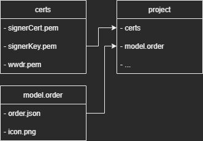

## General

> **Attention: you need to have access to Apple Developer Program in order to use this library.**

A distributable order package is a signed and compressed order ready for donating to Wallet. The order package you distribute contains the JSON description of the order, images, optional localizations, and a signature certifying the authenticity and integrity of the package.

To build an order package, you need to follow these steps:

(1) Create the source files for an order. //manually steps necessary

(2) Create an order type identifier. //manually steps necessary

(3) Generate a signing certificate. //manually steps necessary

(4) Create and write the manifest.

(5) Sign and compress the order package.

The library will support you especially in step (4) and (5).

## Getting Started

### installation

```
npm i wallet-order-generator
```

This library is used to easily create a simple Apple Wallet Order object for import into the Apple Wallet. So far the dynamization is limited, this will be extended in the future.

This library distinguishes between static and dynamic components. To use it, two folders must be created in the root of the project - here are instructions on how to use this library:

### model
Go to the root of your project and create the “model.order” folder.

A model contains all the basic pass data that compose the Order identity. These data can be files (icon, thumbnails, ...), or pieces of information to be written in order.json (Order type identifier, Merchant Identifier, colors, ...) and whatever you know that likely won't be customized on runtime.

order.json example
```
{
    "schemaVersion": 1,
    "orderTypeIdentifier": "order.com.test.example", //change necessary; follow the steps to create order identifier in apple developer portal
    "orderIdentifier": "example", //change necessary
    "orderType": "ecommerce",
    "orderNumber": "1",
    "createdAt": "1994-04-02T09:30:00Z",
    "updatedAt": "2020-09-23T11:43:00Z",
    "status": "completed",
    "merchant": {
        "address": {
            "addressLines": [],
            "locality": "",
            "postalCode": ""
        },
        "displayName": "display name",
        "merchantIdentifier": "merchant.com.example.test", //change necessary; follow the steps to create merchant identifier in apple developer portal
        "logo": "icon.png",
        "url": "https://www.example.de"
    },
    "orderManagementURL": "https://www.example.de",
    "payment": {
        "status": "paid",
        "total": {
            "amount": 7,
            "currency": "USD"
        },
        "paymentMethods": ["•••• 1234"]
    }
}
```
Create order.json (i.e. shown example) and fill in with the basic information, that are orderIdentifier, orderTypeIdentifier, merchantIdentifier and all the other basic keys.

This excerpt is not complete. Further information can be found in the official Apple documentation: https://developer.apple.com/documentation/walletorders/order

Following to this best practice, the package is named model.order. It will result in a folder reading error, if your model folder doesn't have it.
The icon is required in order to make the order work.

### certificates

Go to the root of your project and create a folder named “certs”.

#### Generate a signing certificate
To generate successfully an Order, we'll need to obtain three elements:

- Signer Certificate (Developer)
- Signer Certificate Key (Developer)
- WWDR (Apple WorldWide Developer Relations) G5 Certificate (visit Apple PKI Portal to download it)

1. Create a new order type identifier (direct link) and provide it with a description and a reverse-domain identifier (starting with "order."). You will have to put this identifier as a value for orderTypeIdentifier in the order.json file or as a prop.

Excerpt from the official Apple documentation(https://developer.apple.com/documentation/walletorders/building_a_distributable_order_package):

An order type identifier is a unique identifier for your company or brand. Create your order type identifier in the Certificates, Identifiers & Profiles area of the Apple Developer portal:

- Select Identifiers and then click Add (+).

- On the next screen, choose Order Type ID and click Continue.

- Enter a description, and the reverse DNS string to create the order type identifier.

Set the orderTypeIdentifier in your order.json file to the identifier. Set the orderIdentifier key to a unique order identifier. The order identifier, in combination with the order type identifier, uniquely identifies an order within the system.

2. Confirm and register the new identifier.

3. In the list of your orderTypeIds (filter), click on your new order id to edit it.

4. Click on "Create Certificate".

5. You can now follow the instructions, like providing the Certificate Signing Request required. To generate a Certificate Signing Request (CSR) through the Keychain Access.app, you can follow this guide created by Apple about the topic. Once done, you'll be able to download a certificate like order.cer.

6. Once downloaded the certificate in .cer format, open (import) the downloaded certificate in macOS Keychain Access. Filter for "Certificates" and identify your imported certificate. Right-click on it and select Export "\<certname\>". Choose a password (and write it down) and you will get a PKCS#12 file (.p12).

7. Open the terminal, place yourself where you want to save the files, and use the following OpenSSL commands, by changing the contents between angular brackets first. You'll have to choose a secret passphrase (and write it down) that you'll use also in the application. The first command assumes you haven't created the folder yet.

````
# Creating and changing dir
$ mkdir "certs" && cd $_

# Extracting key and cert from pkcs12
# <your-password> for -passin is the pass for the P12
$ openssl pkcs12 -in <cert-name>.p12 -clcerts -nokeys -out signerCert.pem -passin pass:<your-password>

# <your-password> for -passin is the order for the P12. <secret-passphrase> is the pass you'll pass to wallet-order-generator to decrypt privateKey.
$ openssl pkcs12 -in <cert-name>.p12 -nocerts -out signerKey.pem -passin pass:<your-password> -passout pass:<secret-passphrase>
````

8. Take the WWDR Certificate you downloaded earlier and repeat step 6. Instead of exporting it as .p12 (you should also be unable to export it as such), export it as .pem and save it somewhere.

> please note to keep the name equal, therefore in this stage the names are hardcoded: <br>
> <br>Signer Certificate = signerCert
> <br>Signer Certificate Key = signerKey
> <br>WWDR = wwdr

project structure for setup:



## Usage 

Currently, 11 parameters have to been given and can be changed dynamically:

| Attribute name in order.json  | position number as parameter |
| ------------- | ------------- |
| createdAt  | 1  |
| updatedAt  | 2  |
| status  | 3  |
| merchant.address.addressLines  | 4  |
| merchant.address.locality  | 5  |
| merchant.address.postalCode  | 6  |
| payment.status  | 7  |
| payment.total.amount  | 8  |
| payment.total.currency  | 9  |
| payment.paymentMethods  | 11 + 10  |

Last parameter is the passphrase for the signer key certificate

## Usage Examples

```
/** CommonJS **/
const orderGenerator = require('wallet-order-generator');
```

```
/** Node JS for providing order via webservice **/
router.get('/order', async function(req, res) {

    let readStream = await orderGenerator("2022-06-02T12:30:00Z", "2022-06-02T12:30:00Z", "completed", "example street",
        "example city", "02041994", "paid", "505", "EUR", "9094",
        "••••", "123456789");

    res.setHeader('Content-type', 'application/vnd.apple.finance.order');
    res.setHeader('Content-Disposition', 'attachment;filename=example.order');
    res.send(readStream.toBuffer());
});
```

Made with ❤️ in Moenchengladbach, Germany.